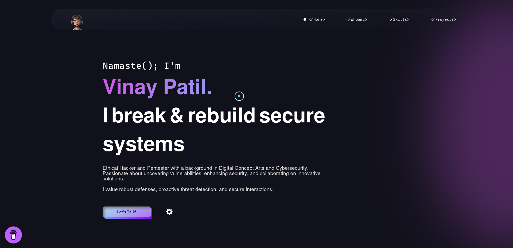

# <a href="https://vinodjangid07.github.io/" target="_blank">🌐 Vinay Patil | Portfolio</a>
Welcome to my portfolio! This repository contains the source code for my personal portfolio website, which showcases my work as a **web developer**, **digital visual artist**, and **certified ethical hacker**.

🔗 **Live Demo:**  
👉 [Vinay Patil Portfolio](https://vinaypatil-132.github.io/Portfolio/)




:star: Star me on GitHub — it helps!

## 👨‍💻 About Me

Hi! I'm **Vinay Patil**, a **certified ethical hacker**, **digital visual artist**, and **web developer** with a solid background in **DevOps**. I take pride in creating secure, functional, and aesthetically pleasing digital experiences, with an emphasis on:
- **Simple content structures**
- **Clean design patterns**
- **Thoughtful interactions**

My portfolio showcases my diverse projects, skills, and expertise across development, security, and design.

## Sections 📚

✔️ Mini intro\
✔️ About me \
✔️ Skills\
✔️ Projects\
✔️ Contact me


## ✨ Features

- **📱 Responsive Design**: Seamlessly adapts across devices (mobile, tablet, desktop).
- **🛠️ Interactive Projects**: Projects are displayed with descriptions and links for deeper exploration.
- **🔒 Security Focus**: Developed with attention to secure coding practices and performance optimization.

## 🛠️ Technologies Used

- **HTML5**
- **CSS3**
- **JavaScript**
- **GitHub Pages** (for hosting)

## 🚀 How to Use

Follow these steps to use the portfolio locally:

1. **Clone the repository**:
   ```bash
   git clone https://github.com/vinaypatil-132/Portfolio.git
   ```
2. Navigate to the project directory:
    ```bash
   cd Portfolio
    ```
3. Open **"index.html"** in your browser to explore the website locally.


## Tools Used 🛠️
* [<b>GitHub</b>](https://github.com/) - To host my static website (HTML, CSS, JS).
* [<b>Animate on scroll library</b>](https://github.com/michalsnik/aos) - To animate my website while scrolling.
* [<b>Animista</b>](https://animista.net/) - To use Interactive animations


## 📬 Contact Me
If you'd like to collaborate or have any inquiries, feel free to reach out!

   - 📧 Email: [vinaycp50@gmail.com]
   - 💼 LinkedIn: https://www.linkedin.com/in/vinay-patil-devops-engineering/

## 🙏 Thanks for Visiting!
